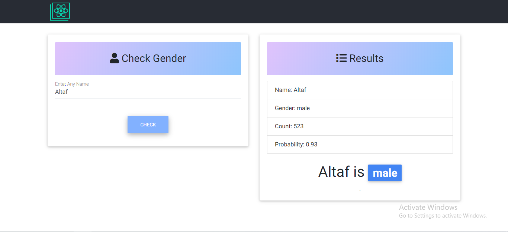

# React Gender Check

Gender Check made with React with MDB.

### Live here:

## Screenshot:



## Features

- you can check your gender by your name.
- The following API is used - `https://api.genderize.io/?name=<anyName>`<br/>
  This returns a JSON object with information about the person name, gender, count & Probability.

## Getting Started

These instructions will get you a copy of the project up and running on your local machine for development and testing purposes.

### Prerequisites

_Node.JS and npm must be installed. Download and install them from [here](https://nodejs.org)._

### Installing

Follow these steps to run this project in your local computer.
Open Terminal
```
$ git clone https://github.com/altaf4web/reactGenderCheck.git
$ cd reactGenderCheck
$ npm install
```

Now, to run the project on port `3000`, run:

```
$ npm start
```

Go to `http://localhost:3000` to view the app.

## Built With

- [React.JS](https://reactjs.org/) -Frontend library used in the project.
- [Material Design for Bootstrap](https://mdbootstrap.com/) - Used for basic styling.

## Authors

- **Altaf Alam** - [altaf4web](https://github.com/altaf4web)

## License

This project is licensed under the MIT License.
